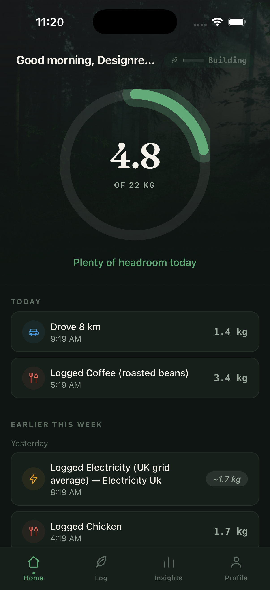
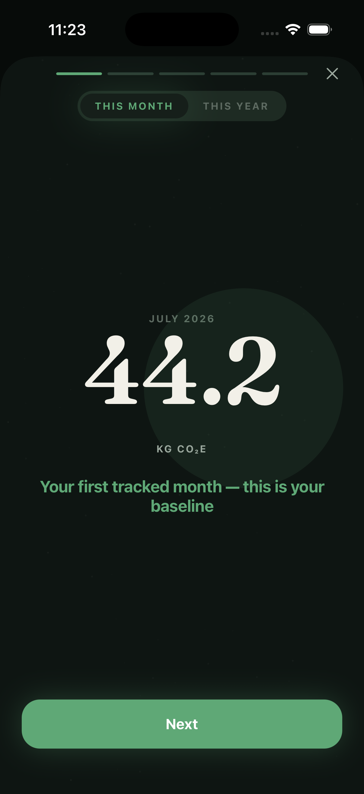
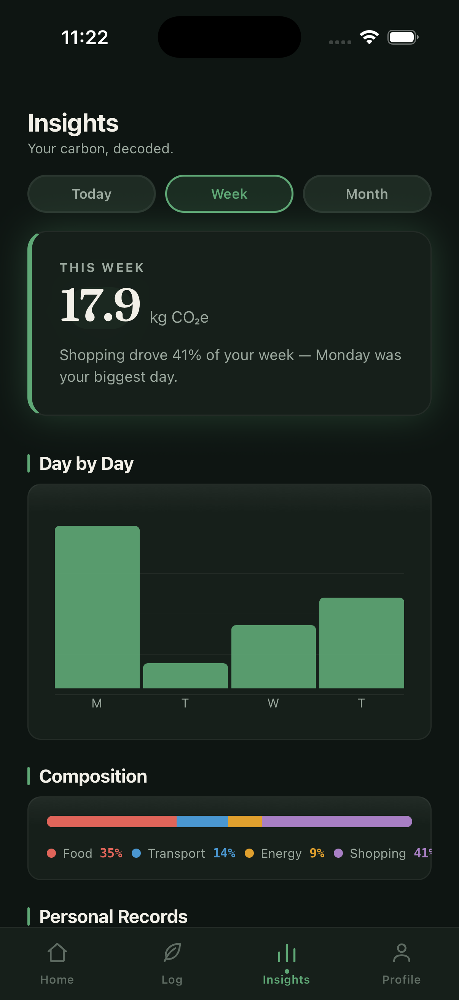
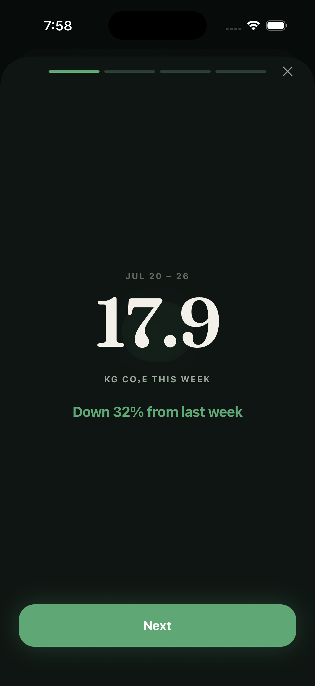

# Veridian: The Carbon Autopilot

**Veridian stops being a logger and becomes an autopilot. It writes your carbon story automatically from signals your life already emits: movement, money, receipts. Your only job is an occasional one-tap confirmation.**

Built with React Native (Expo, New Architecture) and Supabase. Currently in active development. Not yet published to the App Store.

<p align="center">
  
  
  
  
</p>

## Why

Every existing carbon app makes the same bet: ask people to log their life, then guilt them about the number. It doesn't work. Churn is driven by manual-entry fatigue and "single action bias," and the apps that *did* solve tracking (Miles' GPS auto-detection, Greenly's bank integrations) still shut down because passive tracking alone isn't a business.

Veridian's bet: combine every signal a person already emits into one ledger. Phone sensors, bank transactions, forwarded receipts. The *only* manual step is a 10-second daily "confirm 3 things" review, exactly like Copilot Money did for personal finance. Full reasoning in [`docs/NORTH_STAR.md`](docs/NORTH_STAR.md).

## How it's tracked

```
SIGNALS                    INFERENCE                 LEDGER                    LOOP
─────────                  ─────────                 ──────                    ────
Movement (sensors)  ──┐    trip segmentation         emission_entries          auto-commit (high conf)
Money (bank link)   ──┼──▶ mode classification  ──▶  + source/confidence  ──▶  1-tap confirm (mid conf)
Receipts (forward)  ──┘    MCC→NAICS→kgCO₂e/$        + trip/txn linkage        corrections → personal
                           LLM line-item parsing                               priors → quieter over time
```

- **Movement**: background GPS/CoreMotion trip detection covers transport, the ~⅓ of a personal footprint sensors can see for free.
- **Money**: Plaid bank-link estimates food/shopping/fuel spend at the category level the moment a transaction posts.
- **Receipts**: forwarded order confirmations and CSV imports (Amazon, DoorDash) upgrade coarse spend estimates to line-item precision; each receipt supersedes its matching transaction estimate.
- **The loop**: every entry carries a confidence score. High-confidence events commit silently; everything else queues into one daily review moment, and every correction trains a per-user prior so the app needs less input every week.

## Design

Every screen follows a named direction, **"Understory"**: a dark, editorial, forest-floor palette (the layer of a forest beneath the canopy, where the quiet automatic work happens) with a Fraunces serif for hero numbers, moss-green accents, and full-bleed photography instead of generic icon tiles. See [`docs/DESIGN_DIRECTION.md`](docs/DESIGN_DIRECTION.md) and [`docs/USER_JOURNEY.md`](docs/USER_JOURNEY.md) for the full spec and the branching screen map it's applied against.

## Tech stack

- **App**: React Native (Expo SDK 54, New Architecture), TypeScript (strict), Expo Router, React Query, Zustand
- **Motion**: React Native Reanimated 4 exclusively. No legacy `Animated` API anywhere in the codebase
- **Backend**: Supabase (Postgres + Row-Level Security + Edge Functions), with `service_role`-only tables/RPCs for anything touching bank tokens or race-prone writes (e.g. claiming a transaction into an entry uses a `SELECT ... FOR UPDATE`-guarded RPC, not a client-side check-then-insert)
- **Integrations**: Plaid (bank linking + transaction sync), Claude (daily AI insight generation), EPA emission-factor dataset
- **Testing**: Jest + React Native Testing Library. 44 suites / 415 tests covering emission math, hooks, and component behavior

## Status

Sprints A through E are complete: ledger schema, iOS/Android sensor tracking, the Plaid money layer, receipt parsing + Carbon Passport, and a full visual redesign pass (Understory). What's deferred and why is tracked in [`docs/SPRINT_D_SPEC.md`](docs/SPRINT_D_SPEC.md) and [`docs/SPRINT_E_SPEC.md`](docs/SPRINT_E_SPEC.md). Notably, ambient widgets/Live Activities and the OS share-sheet receipt path both require a paid Apple Developer account and are on hold until then.

## Running it locally

```bash
npm install
npx expo start
```

You'll need your own Supabase project and Plaid Sandbox credentials in a `.env` file (see the `EXPO_PUBLIC_*` vars referenced in `lib/supabase.ts`). This is a portfolio/personal project, not set up for external contribution. Feel free to read the code, not to expect it to run without your own backend.
